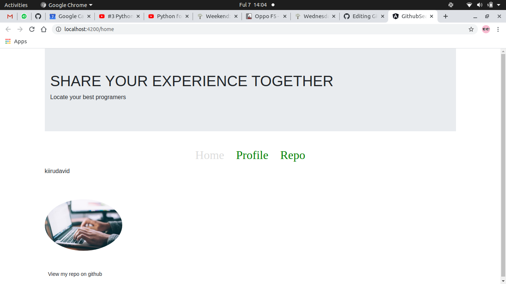

This project was generated with [Angular CLI](https://github.com/angular/angular-cli) version 10.0.6.

## Development server

Run `ng serve` for a dev server. Navigate to `http://localhost:4200/`. The app will automatically reload if you change any of the source files.

## Code scaffolding

Run `ng generate component component-name` to generate a new component. You can also use `ng generate directive|pipe|service|class|guard|interface|enum|module`.

## Build

Run `ng build` to build the project. The build artifacts will be stored in the `dist/` directory. Use the `--prod` flag for a production build.

## Running unit tests

Run `ng test` to execute the unit tests via [Karma](https://karma-runner.github.io).

## Running end-to-end tests

Run `ng e2e` to execute the end-to-end tests via [Protractor](http://www.protractortest.org/).

## Further help

To get more help on the Angular CLI use `ng help` or go check out the [Angular CLI README](https://github.com/angular/angular-cli/blob/master/README.md). -->

# Git search

 Date of current version<strong>*: 08/04/2020*</strong>
 

#### By:

1. David Maina ; lead developer
1. Moringa TM's ; Mentors

## Description

The week's independent project will be evaluated for the following objectives:
*  Project must contain a well-designed landing page that displays your GitHub information such as your username, your profile photos and a list of your repositories.
* Place your access key inside the environment.ts file and place it inside the gitignore file.
* Create a HTTP service that uses a promise to make the requests to the GitHub API.
* The HTTP request should be able to search for both GitHub users and GitHub repositories.
Your project must have two classes for the user and repository.
* Project must have a proper routing structure that links a GitHub username to the users GitHub repositories.
* Project must have a separate routing module.
* Project must contain a custom directive and a custom pipe.
Your Project must be well designed and visually appealing and of portfolio quality.
* Project must have a well-documented README file.
* Project must be deployed and the deployed link should be submitted.

## Setup/Installation Requirements
* Fork the repo
* Create a new branch (git checkout -b improve-feature)
* Make the appropriate changes in the files
* Add changes to reflect the changes made
* Commit your changes (git commit -am 'Improve feature')
* Push to the branch (git push origin improve-feature)
* Create a Pull Request

## Known Bugs
If you find a bug (the website couldn't handle the query and / or gave undesired results), kindly open an issue here by including your search query and the expected result.

If you'd like to request a new function, feel free to do so by opening an issue here. Please include sample queries and their corresponding results.
## Behaviour Driven Development (BDD)

|User Behaviour                    | Input                    | Output         |
|:--------------------------------:|:------------------------:|:--------------:|
|User chooses whether to search for User-Profile or Repos|  Click search profile Button   | Opens profile Page|
|writes user-profile name on search |inputs username in form   | profile details of the user appears |
|User chooses to search user-repos  | click view user repo button | Opens of repo page |
|User writes username on the search | Inputs username in form  | Repo details appear on screen |

## Technologies Used
<a href="https://www.w3schools.com/">HTML W3schools</a> 

<a href="https://css-tricks.com/">CSS trickes</a> 

<a href="https://getbootstrap.com/">Bootstrap</a>

<a href="https://www.w3schools.com/">Angular</a>

## Support and contact details
call me on

:0713275530

:0775581423
 
 :davidmaina085@gmail.com
### License
MIT License

Copyright (c) [2020] [David Kiiru]

Permission is hereby granted, free of charge, to any person obtaining a copy
of this software and associated documentation files (the "Software"), to deal
in the Software without restriction, including without limitation the rights
to use, copy, modify, merge, publish, distribute, sublicense, and/or sell
copies of the Software, and to permit persons to whom the Software is
furnished to do so, subject to the following conditions:

The above copyright notice and this permission notice shall be included in all
copies or substantial portions of the Software.

THE SOFTWARE IS PROVIDED "AS IS", WITHOUT WARRANTY OF ANY KIND, EXPRESS OR
IMPLIED, INCLUDING BUT NOT LIMITED TO THE WARRANTIES OF MERCHANTABILITY,
FITNESS FOR A PARTICULAR PURPOSE AND NONINFRINGEMENT. IN NO EVENT SHALL THE
AUTHORS OR COPYRIGHT HOLDERS BE LIABLE FOR ANY CLAIM, DAMAGES OR OTHER
LIABILITY, WHETHER IN AN ACTION OF CONTRACT, TORT OR OTHERWISE, ARISING FROM,
OUT OF OR IN CONNECTION WITH THE SOFTWARE OR THE USE OR OTHER DEALINGS IN THE
SOFTWARE.
